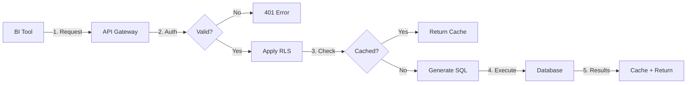

# Architecture

How SetuPranali is designed and how data flows through the system.

---

## System Overview

```
┌─────────────────────────────────────────────────────────────────────┐
│                         BI TOOLS                                    │
├─────────────┬─────────────┬─────────────┬─────────────┬────────────┤
│  Power BI   │   Tableau   │    Excel    │   Looker    │    API     │
│   (OData)   │    (WDC)    │   (OData)   │   (REST)    │   (REST)   │
└──────┬──────┴──────┬──────┴──────┬──────┴──────┬──────┴─────┬──────┘
       │             │             │             │            │
       └─────────────┴─────────────┴─────────────┴────────────┘
                                   │
                    ┌──────────────▼──────────────┐
                    │                             │
                    │       SETUPRANALI           │
                    │                             │
                    ├─────────────────────────────┤
                    │  ┌─────────────────────┐    │
                    │  │   Authentication    │    │
                    │  │   (API Key Check)   │    │
                    │  └──────────┬──────────┘    │
                    │             │               │
                    │  ┌──────────▼──────────┐    │
                    │  │   Authorization     │    │
                    │  │   (RLS Injection)   │    │
                    │  └──────────┬──────────┘    │
                    │             │               │
                    │  ┌──────────▼──────────┐    │
                    │  │   Query Engine      │    │
                    │  │   (SQL Generation)  │    │
                    │  └──────────┬──────────┘    │
                    │             │               │
                    │  ┌──────────▼──────────┐    │    ┌─────────┐
                    │  │   Cache Layer       │◄───┼────│  Redis  │
                    │  │   (Deduplication)   │    │    └─────────┘
                    │  └──────────┬──────────┘    │
                    │             │               │
                    │  ┌──────────▼──────────┐    │
                    │  │   Rate Limiter      │    │
                    │  │   (Protection)      │    │
                    │  └──────────┬──────────┘    │
                    │             │               │
                    │  ┌──────────▼──────────┐    │
                    │  │   Adapter Layer     │    │
                    │  │   (DB Abstraction)  │    │
                    │  └──────────┬──────────┘    │
                    │             │               │
                    └─────────────┼───────────────┘
                                  │
       ┌──────────────────────────┼───────────────────────────┐
       │                         │                            │
┌──────▼──────┐   ┌──────────────▼──────────┐   ┌────────────▼────────┐
│  Snowflake  │   │       BigQuery          │   │     PostgreSQL      │
│             │   │                         │   │                     │
└─────────────┘   └─────────────────────────┘   └─────────────────────┘
```

---

## Components

### API Layer

The API layer exposes multiple protocols:

| Protocol | Endpoint | Use Case |
|----------|----------|----------|
| REST | `/v1/query` | Programmatic access |
| OData | `/odata/{dataset}` | Power BI, Excel |
| WDC | `/wdc/` | Tableau |
| Health | `/health` | Monitoring |

### Authentication

Every request requires an API key:

```python
# app/security.py
def require_api_key(request: Request) -> TenantContext:
    api_key = request.headers.get("X-API-Key")
    
    # Validate key
    key_config = validate_key(api_key)
    
    # Return tenant context
    return TenantContext(
        tenant=key_config.tenant,
        role=key_config.role
    )
```

### Authorization (RLS)

Row-level security is injected automatically:

```python
# app/query_engine.py
def apply_rls(query: str, context: TenantContext, dataset: Dataset) -> str:
    if dataset.rls and context.tenant:
        rls_clause = f"{dataset.rls.tenant_column} = '{context.tenant}'"
        query = inject_where_clause(query, rls_clause)
    return query
```

### Query Engine

Translates semantic requests to SQL using SQLGlot:

**SQLGlot Integration**:
- Parses and validates SQL queries
- Converts between database dialects automatically
- Builds queries programmatically (prevents SQL injection)
- Applies RLS filters safely using AST manipulation

**Query Flow**:
```
{                                  SQLGlot AST
  "dataset": "sales",      →         (parsed)
  "dimensions": ["region"],          ↓
  "metrics": ["revenue"]           Convert to dialect
}                                  ↓
                                   SELECT
                                     region,
                                     SUM(amount) AS revenue
                                   FROM fact_sales
                                   WHERE tenant_id = 'acme'
                                   GROUP BY region
```

**Dialect Conversion**:
- PostgreSQL SQL → Snowflake SQL (automatic)
- BigQuery SQL → PostgreSQL SQL (automatic)
- All major dialects supported

### Cache Layer

Redis-based caching with deduplication:

```python
# Cache key includes query + tenant
cache_key = hash(query_params, tenant_id)

# Check cache
cached = redis.get(cache_key)
if cached:
    return cached  # Cache hit

# Execute query
result = execute_query(...)

# Store in cache
redis.setex(cache_key, ttl=300, value=result)
```

### Adapter Layer

Database-agnostic abstraction:

```python
class BaseAdapter(ABC):
    @abstractmethod
    def connect(self) -> Any:
        """Establish connection"""
    
    @abstractmethod
    def execute_query(self, sql: str) -> Tuple[List, List[Dict]]:
        """Execute SQL and return (rows, columns)"""
```

---

## Data Flow

### Query Flow



### Detailed Steps

1. **Request Received**
   - API key extracted from header
   - Request parsed (JSON or OData)

2. **Authentication**
   - API key validated
   - Tenant context created

3. **Authorization**
   - RLS rules looked up
   - WHERE clause prepared

4. **Cache Check**
   - Cache key computed
   - Redis lookup performed

5. **Query Generation**
   - Semantic model resolved
   - SQL constructed
   - RLS injected

6. **Execution**
   - Connection obtained
   - Query executed
   - Results fetched

7. **Response**
   - Results cached
   - JSON returned

---

## Deployment Topology

### Single Node

```
┌──────────────────────────────┐
│     Docker Container         │
│  ┌────────────────────────┐  │
│  │  SetuPranali (8080)    │  │
│  └────────────────────────┘  │
│  ┌────────────────────────┐  │
│  │  Redis (6379)          │  │
│  └────────────────────────┘  │
└──────────────────────────────┘
```

### High Availability

```
                    ┌─────────────────┐
                    │  Load Balancer  │
                    └────────┬────────┘
           ┌─────────────────┼─────────────────┐
           │                 │                 │
    ┌──────▼──────┐   ┌──────▼──────┐   ┌──────▼──────┐
    │   UBI #1    │   │   UBI #2    │   │   UBI #3    │
    └──────┬──────┘   └──────┬──────┘   └──────┬──────┘
           │                 │                 │
           └─────────────────┼─────────────────┘
                             │
                    ┌────────▼────────┐
                    │  Redis Cluster  │
                    └─────────────────┘
```

---

## Performance Considerations

### Connection Pooling

Each adapter maintains a connection pool:

```python
# PostgreSQL example
pool = psycopg2.pool.ThreadedConnectionPool(
    minconn=1,
    maxconn=10,
    **connection_params
)
```

### Query Optimization

- Pushdown filters to database
- Limit result sets
- Use database-native aggregations

### Cache Strategy

| Strategy | TTL | Use Case |
|----------|-----|----------|
| Short-lived | 60s | Real-time dashboards |
| Medium | 300s | Standard reports |
| Long-lived | 3600s | Historical analysis |

---

## Security Architecture

### Defense in Depth

```
Layer 1: Network (Firewall, VPN)
    ↓
Layer 2: TLS (Encryption in transit)
    ↓
Layer 3: API Key (Authentication)
    ↓
Layer 4: RLS (Authorization)
    ↓
Layer 5: Rate Limiting (Abuse prevention)
    ↓
Layer 6: Query Guards (Resource protection)
```

### Credential Isolation

```
┌──────────────────────────────────────────────────┐
│                  BI USERS                         │
│  (Never see database credentials)                 │
│  Only have: API Key                               │
└──────────────────────────────────────────────────┘
                      │
                      ▼
┌──────────────────────────────────────────────────┐
│               SETUPRANALI                         │
│  Has: Encrypted database credentials              │
│  Stores: In SQLite with Fernet encryption         │
└──────────────────────────────────────────────────┘
                      │
                      ▼
┌──────────────────────────────────────────────────┐
│              DATA WAREHOUSE                       │
│  Has: Service account with minimal permissions    │
└──────────────────────────────────────────────────┘
```

