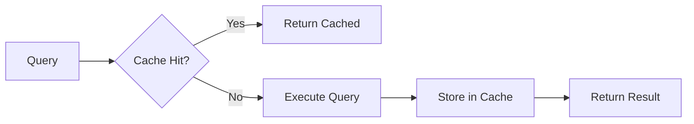

# Caching

How SetuPranali caches queries for performance.

---

## Overview

Caching reduces load on your data warehouse and speeds up repeated queries.



---

## How It Works

### Cache Key

Each query generates a unique cache key based on:

- Dataset name
- Dimensions
- Metrics
- Filters
- Sort order
- Tenant ID (RLS)

```python
cache_key = hash(
    dataset="orders",
    dimensions=["region"],
    metrics=["revenue"],
    filters=[...],
    tenant="acme_corp"
)
```

!!! info "Tenant Isolation"
    Tenant ID is always part of the cache key. Tenant A cannot see Tenant B's cached results.

### Cache Storage

Redis stores cached results:

```bash
# .env
REDIS_URL=redis://localhost:6379
CACHE_TTL_SECONDS=300
```

### Cache Entry

```json
{
  "columns": [...],
  "rows": [...],
  "stats": {...},
  "cachedAt": "2024-01-15T10:30:00Z"
}
```

---

## Configuration

### Environment Variables

| Variable | Default | Description |
|----------|---------|-------------|
| `REDIS_URL` | `redis://localhost:6379` | Redis connection URL |
| `CACHE_TTL_SECONDS` | `300` | Cache duration (5 min) |
| `CACHE_MAX_SIZE_MB` | `100` | Max cache size |
| `CACHE_ENABLED` | `true` | Enable/disable caching |

### Redis Setup

=== "Docker"

    ```yaml
    services:
      redis:
        image: redis:7-alpine
        ports:
          - "6379:6379"
        volumes:
          - redis-data:/data
    ```

=== "Docker Run"

    ```bash
    docker run -d --name redis -p 6379:6379 redis:7-alpine
    ```

=== "Kubernetes"

    ```yaml
    apiVersion: apps/v1
    kind: Deployment
    metadata:
      name: redis
    spec:
      replicas: 1
      template:
        spec:
          containers:
            - name: redis
              image: redis:7-alpine
              ports:
                - containerPort: 6379
    ```

---

## Cache Behavior

### Cache Hit

When a matching query is found:

```json
{
  "columns": [...],
  "rows": [...],
  "stats": {
    "cached": true,
    "cachedAt": "2024-01-15T10:30:00Z",
    "executionTimeMs": 2
  }
}
```

### Cache Miss

When no cached result exists:

```json
{
  "columns": [...],
  "rows": [...],
  "stats": {
    "cached": false,
    "executionTimeMs": 234
  }
}
```

---

## Query Deduplication

When multiple identical queries arrive simultaneously:

```
Query A ──┐
Query B ──┼── First query executes ──→ Single DB call
Query C ──┘                          ↓
                                All three get same result
```

This prevents "thundering herd" problems during dashboard loads.

### How It Works

```python
# Pseudocode
lock = acquire_lock(cache_key, timeout=5)
if lock:
    # First request: execute and cache
    result = execute_query()
    cache.set(cache_key, result)
    release_lock(lock)
else:
    # Waiting requests: poll cache
    result = wait_for_cache(cache_key)
```

---

## Cache Invalidation

### TTL-Based

Cached entries expire automatically:

```bash
CACHE_TTL_SECONDS=300  # 5 minutes
```

### Manual Invalidation

Clear cache for a dataset:

```bash
curl -X POST http://localhost:8080/admin/cache/clear \
  -H "X-API-Key: admin-key" \
  -d '{"dataset": "orders"}'
```

Clear all cache:

```bash
curl -X POST http://localhost:8080/admin/cache/clear-all \
  -H "X-API-Key: admin-key"
```

### Event-Based

Invalidate on data changes (advanced):

```python
# After ETL completes
redis.delete_pattern("cache:orders:*")
```

---

## Cache Strategies

### Real-Time Dashboards

Short TTL for fresh data:

```bash
CACHE_TTL_SECONDS=60  # 1 minute
```

### Standard Reports

Medium TTL for balance:

```bash
CACHE_TTL_SECONDS=300  # 5 minutes
```

### Historical Analysis

Long TTL for efficiency:

```bash
CACHE_TTL_SECONDS=3600  # 1 hour
```

### Per-Dataset TTL (Advanced)

```yaml
# catalog.yaml
datasets:
  - name: real_time_orders
    cache_ttl: 30
  
  - name: historical_sales
    cache_ttl: 3600
```

---

## Monitoring

### Cache Statistics

```bash
curl http://localhost:8080/admin/cache/stats \
  -H "X-API-Key: admin-key"
```

Response:

```json
{
  "hits": 1523,
  "misses": 342,
  "hitRate": 0.817,
  "memoryUsedMb": 45.2,
  "keyCount": 892
}
```

### Redis Metrics

```bash
redis-cli INFO stats
```

Key metrics:
- `keyspace_hits`
- `keyspace_misses`
- `used_memory`
- `connected_clients`

---

## Performance Impact

### With Caching

| Scenario | Without Cache | With Cache | Improvement |
|----------|---------------|------------|-------------|
| Simple query | 150ms | 5ms | 30x |
| Complex aggregation | 2000ms | 5ms | 400x |
| Dashboard load (10 queries) | 3000ms | 200ms | 15x |

### Database Load Reduction

With a 5-minute TTL and typical usage:

- 10 users refreshing every 30 seconds
- Without cache: 200 queries/minute
- With cache: ~2 queries/minute (deduplication)
- **99% reduction in database load**

---

## Best Practices

### Sizing

```bash
# Estimate cache size
# Avg result: 50KB × 1000 queries = 50MB
CACHE_MAX_SIZE_MB=100
```

### Redis Configuration

```conf
# redis.conf
maxmemory 256mb
maxmemory-policy allkeys-lru  # Evict least recently used
```

### High Availability

```yaml
# Redis Sentinel or Cluster for production
REDIS_URL=redis://sentinel:26379/0?sentinel=mymaster
```

### Monitoring Alerts

Set up alerts for:

- Cache hit rate < 70%
- Redis memory > 80%
- Cache misses spike
- Redis connection failures

---

## Troubleshooting

### Low Hit Rate

**Symptoms**: Hit rate < 50%

**Causes**:
- TTL too short
- Many unique queries
- High cardinality dimensions

**Solutions**:
- Increase TTL
- Review query patterns
- Add query standardization

### Redis Connection Issues

**Symptoms**: "Redis connection refused"

**Causes**:
- Redis not running
- Wrong URL
- Network issues

**Solutions**:
```bash
# Check Redis
redis-cli ping

# Check connection
curl http://localhost:8080/health
```

### Cache Not Working

**Symptoms**: Every query hits database

**Causes**:
- `CACHE_ENABLED=false`
- Redis not connected
- TTL = 0

**Solutions**:
```bash
# Verify settings
echo $CACHE_ENABLED
echo $CACHE_TTL_SECONDS
redis-cli ping
```

