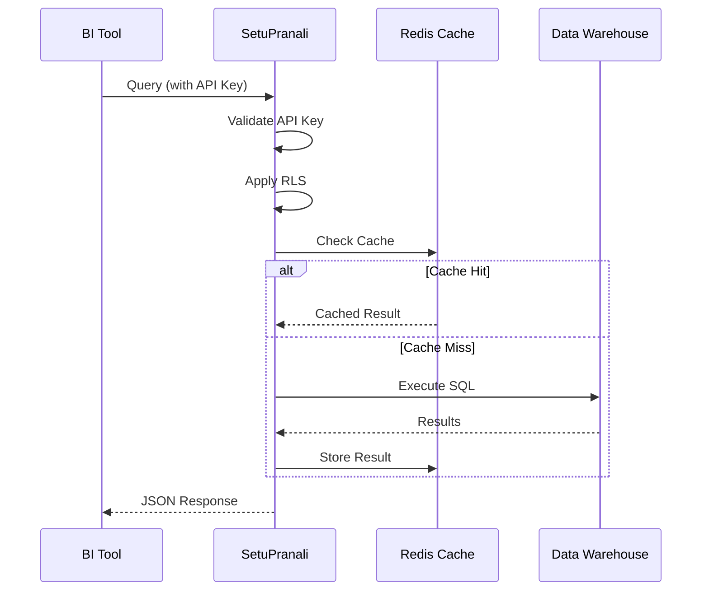

# Concepts

Understand the core concepts behind SetuPranali.

---

## Overview

SetuPranali is a **semantic gateway** that sits between your 
BI tools and your data sources. It provides:

- **Unified Access**: One API for all BI tools
- **Security Layer**: Authentication and authorization
- **Semantic Layer**: Consistent metrics and dimensions
- **Performance Layer**: Caching and rate limiting

---

## Core Concepts

-   :material-sitemap:{ .lg .middle } **Architecture**

    ---

    How the system is structured and how data flows.

    [:octicons-arrow-right-24: Architecture](architecture.md)

-   :material-layers:{ .lg .middle } **Semantic Layer**

    ---

    Datasets, dimensions, metrics, and relationships.

    [:octicons-arrow-right-24: Semantic Layer](semantic-layer.md)

-   :material-shield-lock:{ .lg .middle } **Security Model**

    ---

    Authentication, authorization, and row-level security.

    [:octicons-arrow-right-24: Security](security.md)

-   :material-cached:{ .lg .middle } **Caching**

    ---

    Query caching and deduplication.

    [:octicons-arrow-right-24: Caching](caching.md)

-   :material-speedometer:{ .lg .middle } **Rate Limiting**

    ---

    Protecting your data warehouse.

    [:octicons-arrow-right-24: Rate Limiting](rate-limiting.md)

---

## How It Works

---

## Key Principles

### 1. Security First

- Database credentials never touch BI tools
- Every request is authenticated
- Row-level security is automatic
- Tenant isolation is enforced

### 2. Source of Truth

- One definition of each metric
- Consistent across all BI tools
- Version-controlled in YAML
- No drift between dashboards

### 3. Performance

- Intelligent caching reduces load
- Query deduplication prevents stampedes
- Rate limiting protects resources
- Connection pooling for efficiency

### 4. Flexibility

- Works with any database
- Works with any BI tool
- No vendor lock-in
- Bring your own models

