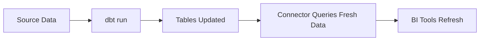

# dbt Integration

Use dbt models with SetuPranali.

---

## Overview

Point SetuPranali at your dbt mart tables:

```
dbt models → Warehouse tables → SetuPranali → BI Tools
```

Your dbt handles transformations; SetuPranali handles access.

---

## Setup

### 1. Run dbt

Ensure models are materialized:

```bash
dbt run
```

### 2. Reference Tables

Point datasets to dbt tables:

```yaml
# catalog.yaml
datasets:
  - name: orders
    source: snowflake-prod
    table: analytics.fct_orders  # dbt model
    
    dimensions:
      - name: region
        type: string
        expr: region
      
      - name: order_date
        type: date
        expr: order_date
    
    metrics:
      - name: revenue
        type: number
        expr: "SUM(amount)"
```

---

## Example Project

### dbt Models

```sql
-- models/marts/fct_orders.sql
{{ config(materialized='table') }}

SELECT
    order_id,
    customer_id,
    region,
    order_date,
    amount,
    tenant_id  -- For RLS
FROM {{ ref('stg_orders') }}
WHERE status != 'cancelled'
```

### catalog.yaml

```yaml
datasets:
  - name: orders
    source: snowflake-prod
    table: analytics.fct_orders
    
    dimensions:
      - name: region
        type: string
        expr: region
        description: "{{ doc('region') }}"  # Use dbt docs
      
      - name: order_date
        type: date
        expr: order_date
    
    metrics:
      - name: revenue
        type: number
        expr: "SUM(amount)"
      
      - name: orders
        type: number
        expr: "COUNT(*)"
    
    rls:
      tenant_column: tenant_id
```

---

## Best Practices

### 1. Use Mart Tables

Reference mart (final) tables, not staging:

```yaml
# Good
table: analytics.fct_orders

# Avoid
table: analytics.stg_orders
```

### 2. Simple Expressions

Keep SetuPranali expressions simple since dbt handles transformations:

```yaml
# Good: Simple reference
dimensions:
  - name: region
    expr: region

# Avoid: Complex logic (put in dbt)
dimensions:
  - name: region
    expr: "CASE WHEN region_code IN ('NY','NJ') THEN 'Northeast' ..."
```

### 3. Include Tenant Column

Add tenant column in dbt for RLS:

```sql
-- dbt model
SELECT
    ...,
    organization_id as tenant_id
FROM ...
```

### 4. Sync Documentation

Use dbt docs in catalog descriptions:

```yaml
description: "{{ doc('orders') }}"
```

---

## Materialization Strategies

### Tables

Best for:
- Frequently queried data
- Large datasets
- Dashboard performance

```sql
{{ config(materialized='table') }}
```

### Views

Best for:
- Real-time requirements
- Simple transformations
- Rarely queried data

```sql
{{ config(materialized='view') }}
```

### Incremental

Best for:
- Event data
- Large historical tables
- Append-only patterns

```sql
{{ config(materialized='incremental') }}
```

---

## CI/CD Integration

### Refresh Flow



### Automated Pipeline

```yaml
# GitHub Actions example
name: dbt + BI Refresh

on:
  schedule:
    - cron: '0 */4 * * *'  # Every 4 hours

jobs:
  refresh:
    runs-on: ubuntu-latest
    steps:
      - uses: actions/checkout@v2
      
      - name: Run dbt
        run: |
          dbt deps
          dbt run
          dbt test
      
      - name: Clear BI Cache
        run: |
          curl -X POST $CONNECTOR_URL/admin/cache/clear \
            -H "X-API-Key: $ADMIN_KEY"
```

---

## Troubleshooting

### Table Not Found

```
Dataset 'orders' table 'analytics.fct_orders' not found
```

**Solutions**:
1. Verify dbt model ran successfully
2. Check schema name matches
3. Verify connector source has access

### Stale Data

**Symptoms**: BI shows old data

**Solutions**:
1. Run `dbt run` to refresh
2. Clear connector cache:
```bash
curl -X POST http://localhost:8080/admin/cache/clear \
  -H "X-API-Key: admin-key"
```

### Missing Columns

**Symptoms**: Dimension not found

**Solutions**:
1. Verify column exists in dbt model
2. Check column name matches expression
3. Re-run dbt after schema changes

